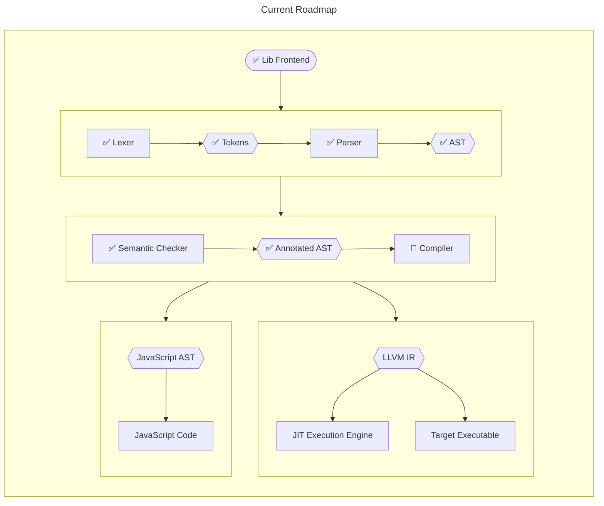

# The Mabel Compiler

[](https://github.com/heinthanth/mabel/actions/workflows/ci.yaml)
[](https://codecov.io/gh/heinthanth/mabel)


This is the main repo for the WIP Mabel compiler.

## Development

For ease of development, there're several [cargo-make](https://github.com/sagiegurari/cargo-make) tasks.



### Build and Run

This is equivalent to running `RUSTFLAGS="-Awarnings" cargo run -q -- [...args]`.
This will suppress rustc warnings and cargo outputs to make it feel like running the executable itself.

```
cargo make mabel-dev [...args]
```

### Testing

This is equivalent to running `cargo test [...args]`.

```
cargo make test [...args]
```

### Coverage

This is equivalent to running `cargo llvm-cov args`. [cargo-llvm-cov](https://github.com/taiki-e/cargo-llvm-cov) needs to be installed.

```
cargo make coverage [...args]
```

As of now, I can't write test cases for all modules since working with AST is very inconvenient given that AST contains kind, token, etc.

Those files will be later tested with [mabel source codes](tests) when, at least, the JIT execution engine is finished.

## License

Mabel is distributed under MIT license. This will be updated later based on used dependencies.

See [LICENSE](LICENSE) for details.
